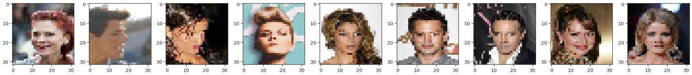
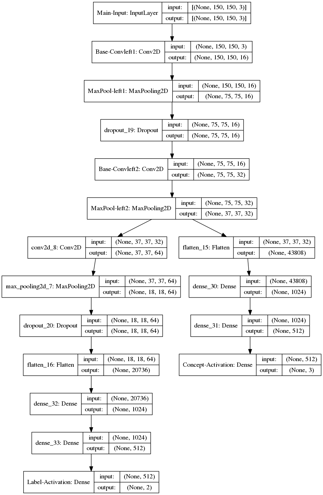

# Using a multi output convolutional network to interpret inherent concepts

### 1. Import the libraries


```python
# This Source Code Form is subject to the terms of the MIT
# License. If a copy of the same was not distributed with this
# file, You can obtain one at
# https://github.com/akhilpandey95/interpretability/blob/master/LICENSE.

import os
import pickle
import numpy as np
import pandas as pd
import seaborn as sns
from tqdm import tqdm
import tensorflow as tf
from PIL import Image
from IPython.display import display
import matplotlib.pyplot as plt
import tensorflow.keras as keras
from tensorflow.keras import Model
from tensorflow.keras.models import Sequential
from tensorflow.keras.layers import Input, Dense, Conv2D, Flatten, Dropout, MaxPooling2D
from tensorflow.keras.preprocessing.image import load_img, img_to_array, ImageDataGenerator
```

### 2. Read the dataset

#### 2.1 Textual attributes pertaining to the public individuals


```python
# set the path
PATH = '/media/hector/data/datasets/interpretability/'

# change the current working directory
os.chdir(PATH)

# read the attribute information
attributes = pd.read_csv('list_attr_celeba.csv')

# print the clumns
attributes.columns
```


    Index(['image_id', '5_o_Clock_Shadow', 'Arched_Eyebrows', 'Attractive',
           'Bags_Under_Eyes', 'Bald', 'Bangs', 'Big_Lips', 'Big_Nose',
           'Black_Hair', 'Blond_Hair', 'Blurry', 'Brown_Hair', 'Bushy_Eyebrows',
           'Chubby', 'Double_Chin', 'Eyeglasses', 'Goatee', 'Gray_Hair',
           'Heavy_Makeup', 'High_Cheekbones', 'Male', 'Mouth_Slightly_Open',
           'Mustache', 'Narrow_Eyes', 'No_Beard', 'Oval_Face', 'Pale_Skin',
           'Pointy_Nose', 'Receding_Hairline', 'Rosy_Cheeks', 'Sideburns',
           'Smiling', 'Straight_Hair', 'Wavy_Hair', 'Wearing_Earrings',
           'Wearing_Hat', 'Wearing_Lipstick', 'Wearing_Necklace',
           'Wearing_Necktie', 'Young'],
          dtype='object')


##### 2.1.2 Visualize the distribution of males to females


```python
plt.figure(num=None, figsize=(10, 8), dpi=300, facecolor='w', edgecolor='k')
sns.set(font_scale = 1.2, style='ticks')

sns.countplot(attributes.Male.
              apply(lambda x: 'Male' if x == 1 else 'Female'))
plt.xlabel('\nGender', fontdict={'size': 14})
plt.ylabel('Count', fontdict={'size': 14})
plt.title('Number of males to females samples in the dataset', fontdict={'size': 14})
plt.show()
```


#### 2.2 Image data for all the public individuals


```python
 # function for gathering image data
def generate_samples():
    """
    Gather the cats and dogs image dataset using tensorflow
    
    Parameters
    ----------
    None
    
    Returns
    -------
    String, String, String, String
        str, str, str, str
    """
    try:
        # set the URI
        _URL = 'https://storage.googleapis.com/mledu-datasets/cats_and_dogs_filtered.zip'
        
        # set the path to the zip file
        path_to_zip = tf.keras.utils.get_file('cats_and_dogs.zip', origin=_URL, extract=True)
        
        # set the PATH
        PATH = os.path.join(os.path.dirname(path_to_zip), 'cats_and_dogs_filtered')
        
        # assemble the training images into train directory
        train_dir = os.path.join(PATH, 'train')
        
        # assemble the validation images into validation directory
        validation_dir = os.path.join(PATH, 'validation')

        # return the data
        return train_dir, validation_dir
    except:
        return np.zeros(1)

 # function for preparding the image data for training
def prepare_data(train_dir, validation_dir, batch_size, img_height, img_width):
    """
    Prepare the image data by extracting
    the images from respective training and
    validation directories
    Parameters
    ----------
    arg1 | train_dir: str
        The directory path where training images are located
    arg2 | validation_dir: str
        The directory path where validation images are located
    arg3 | batch_size: int
        The size of the batch of images to be used while training/validation
    arg4 | img_height: int
        The directory path where validation images are located
    arg5 | img_width: int
        The size of the batch of images to be used while training/validation
    Returns
    -------
    Array
        numpy.ndarray
    """
    try:
        # create a image generator object for the training data
        train_image_generator = ImageDataGenerator(rescale=1./255,
                                                   rotation_range=55,
                                                   width_shift_range=.35,
                                                   height_shift_range=.35,
                                                   horizontal_flip=True,
                                                   zoom_range=0.3)

        # create a image generator object for the validation data
        val_image_generator = ImageDataGenerator(rescale=1./255,
                                                   rotation_range=55,
                                                   width_shift_range=.35,
                                                   height_shift_range=.35,
                                                   horizontal_flip=True,
                                                   zoom_range=0.3)

        # augment the training images using the train image generator
        train_data_gen = train_image_generator.flow_from_directory(batch_size=batch_size,
                                                           directory=train_dir,
                                                           shuffle=True,
                                                           target_size=(img_height, img_width),
                                                           class_mode='binary')

        # augment the training images using the train image generator
        val_data_gen = val_image_generator.flow_from_directory(batch_size=batch_size,
                                                            directory=validation_dir,
                                                            target_size=(img_height, img_width),
                                                            class_mode='binary')
        
        # return 
        return train_data_gen, val_data_gen
    except:
        return np.zeros(1)
```

#### 2.2.2 Prepare the Inputs


```python
dir_data      = "./img_align_celeba/"
Ntrain        = 120000 
Ntest         = 80100
nm_imgs       = np.sort(os.listdir(dir_data))
## name of the jpg files for training set
nm_imgs_train = nm_imgs[:Ntrain]
## name of the jpg files for the testing data
nm_imgs_test  = nm_imgs[Ntrain:Ntrain + Ntest]
img_shape     = (32, 32, 3)

def get_npdata(nm_imgs_train):
    X_train = []
    for i, myid in enumerate(tqdm(nm_imgs_train)):
        image = load_img(dir_data + "/" + myid,
                         target_size=img_shape[:2])
        image = img_to_array(image)/255.0
        X_train.append(image)
    X_train = np.array(X_train)
    return(X_train)

X_train = get_npdata(nm_imgs_train)
X_test  = get_npdata(nm_imgs_test)

print("X_train.shape = {}".format(X_train.shape))
print("X_test.shape = {}".format(X_test.shape))
```

    100%|██████████| 120000/120000 [01:57<00:00, 1024.29it/s]
    100%|██████████| 80100/80100 [01:10<00:00, 1129.61it/s]


    X_train.shape = (120000, 32, 32, 3)
    X_test.shape = (80100, 32, 32, 3)


##### 2.2.3 Prepare the output labels for the gender


```python
# Prepare the labels for the train images
Y_train = np.array(list(map(lambda x: \
                            attributes.loc[attributes.image_id == x]['Male'].values[0],\
                            tqdm(nm_imgs_train))))

# Reshape the output labels for the train data
Y_train = Y_train.reshape(-1, 1)

# Prepare the labels for the test images
Y_test = np.array(list(map(lambda x: \
                            attributes.loc[attributes.image_id == x]['Male'].values[0],\
                            tqdm(nm_imgs_test))))

# Reshape the output labels for the test data
Y_test = Y_test.reshape(-1, 1)
```

    100%|██████████| 120000/120000 [20:33<00:00, 97.28it/s] 
    100%|██████████| 80100/80100 [13:54<00:00, 96.02it/s] 


```python
# Prepare the concept labels for the train images
Y_train_concepts = np.array(list(map(lambda x: \
                            [attributes.loc[attributes.image_id == x][\
                            ['Attractive', 'Chubby', 'Wearing_Necktie']].values[0]],\
                            tqdm(nm_imgs_train))))

# Reshape the output labels for the train data
Y_train_concepts = Y_train_concepts.reshape(-1, 1)

# Prepare the labels for the test images
Y_test_concepts = np.array(list(map(lambda x: \
                            [attributes.loc[attributes.image_id == x][\
                            ['Attractive', 'Chubby', 'Wearing_Necktie']].values[0]],\
                            tqdm(nm_imgs_test))))

# Reshape the output labels for the test data
Y_test_concepts = Y_test_concepts.reshape(-1, 1)
```

    100%|██████████| 120000/120000 [21:14<00:00, 94.14it/s] 
    100%|██████████| 80100/80100 [14:40<00:00, 91.01it/s] 


##### 2.2.5 Save the models to a pickle file


```python
# save the input training data
with open('X_train.pkl','wb') as f:
    # dumpy the training image tensors
    pickle.dump(X_train, f)
    
# save the input test data
with open('X_test.pkl','wb') as f:
    # dumpy the test image tensors
    pickle.dump(X_test, f)
    
# save the output label training data
with open('Y_train.pkl','wb') as f:
    # dumpy the training image labels
    pickle.dump(Y_train, f)
    
# save the output concept training data
with open('Y_train_concepts.pkl','wb') as f:
    # dumpy the training image concepts
    pickle.dump(Y_train_concepts, f)
    
# save the output label test data
with open('Y_test.pkl','wb') as f:
    # dumpy the test image labels
    pickle.dump(Y_test, f)
    
# save the output concept test data
with open('Y_test_concepts.pkl','wb') as f:
    # dumpy the test image concepts
    pickle.dump(Y_test_concepts, f)
```

##### 2.2.4 Visualize sample images


```python
fig= plt.figure(figsize=(30,10))

for img_index in range(1, 10):
    ax = fig.add_subplot(1,10,img_index)
    ax.imshow(X_train[img_index])
plt.tight_layout()
plt.show()
```





### 3. Helper methods for defining the CNN model


```python
# function for creating the base model
def base_model(inputs):
    """
    Prepare the base model of the CNN with input layer
    and two convolutional layers
    Parameters
    ----------
    arg1 | inputs: numpy.ndarray
        The array storing training images are located
    Returns
    -------
    Model, Model
        tf.keras.Model, tf.keras.Model
    """
    try:
        # add the input layer
        images = Input(shape=inputs, name='Main-Input')

         # add the first conv layer with relu activation
        base_conv_1 = Conv2D(16, 3, padding='same', activation='relu', name='Base-Convleft1')(images)

        # add a max pooling layer
        base_conv_1 = MaxPooling2D(name='MaxPool-left1')(base_conv_1)

        # add a dropout layer
        base_conv_1 = Dropout(0.2)(base_conv_1)

        # add the second conv layer with relu activation
        base_conv_2 = Conv2D(32, 3, padding='same', activation='relu', name='Base-Convleft2')(base_conv_1)

        # add a max pooling layer
        base_conv_2 = MaxPooling2D(name='MaxPool-left2')(base_conv_2)

        # return the base model
        return images, base_conv_2
    except:
        # return empty model
        return tf.keras.Model, tf.keras.Model

# function for creating the concept model
def concept_model(base, outputs):
    """
    Prepare the concept model that is attached
    to the left side of the base model
    Parameters
    ----------
    arg1 | model: tf.keras.Model
        The base model
    arg2 | outputs: int
        The number of concepts we are inferring
    Returns
    -------
    Model
        tf.keras.Model
    """
    try:
        # flatten the activations in order to connect it to a fully connected layer
        concepts = Flatten()(base)

        # add a fully connected layer with relu activation
        concepts = Dense(1024, activation='relu')(concepts)
        
        # add another fully connected layer with relu activation
        concepts = Dense(512, activation='relu')(concepts)

        # add the output layer
        concepts = Dense(outputs, activation='tanh', name='Concept-Activation')(concepts)

        # return the combined model
        return concepts
    except:
        # return empty model
        return tf.keras.Model

# function for creating the classification model
def classification_model(base, outputs):
    """
    Prepare the classification model that is attached
    to the right side of the base model
    Parameters
    ----------
    arg1 | model: tf.keras.Model
        The base model
    arg2 | outputs: int
        The number of classes we are predicting
    Returns
    -------
    Array
        numpy.ndarray
    """
    try:
        # add the third conv layer with relu activation
        classes = Conv2D(64, 3, padding='same', activation='relu')(base)

        # add a max pooling layer
        classes = MaxPooling2D()(classes)

        # add a dropout layer
        classes = Dropout(0.2)(classes)

        # flatten the activations in order to connect it to a fully connected layer
        classes = Flatten()(classes)

        # add a fully connected layer with relu activation
        classes = Dense(1024, activation='relu')(classes)
        
        # add another fully connected layer with relu activation
        classes = Dense(512, activation='relu')(classes)

        # add the output layer
        classes = Dense(outputs, activation='softmax', name='Label-Activation')(classes)

        # return the combined model
        return classes
    except:
        # return empty model
        return tf.keras.Model
```

#### 3.2 Build the model


```python
# build the base model
images, bridge_conv_layer = base_model((150, 150, 3))

# add the left side of the network
concepts_nn = concept_model(bridge_conv_layer, 3)

# add the right side of the network
classification_nn = classification_model(bridge_conv_layer, 2)

# build the model
model = tf.keras.Model(inputs=images, \
                       outputs=[classification_nn, concepts_nn], \
                      name = 'ConcUndNN')

# print the model summary
model.summary()
```

    Model: "ConcUndNN"
    __________________________________________________________________________________________________
    Layer (type)                    Output Shape         Param #     Connected to                     
    ==================================================================================================
    Main-Input (InputLayer)         [(None, 150, 150, 3) 0                                            
    __________________________________________________________________________________________________
    Base-Convleft1 (Conv2D)         (None, 150, 150, 16) 448         Main-Input[0][0]                 
    __________________________________________________________________________________________________
    MaxPool-left1 (MaxPooling2D)    (None, 75, 75, 16)   0           Base-Convleft1[0][0]             
    __________________________________________________________________________________________________
    dropout_19 (Dropout)            (None, 75, 75, 16)   0           MaxPool-left1[0][0]              
    __________________________________________________________________________________________________
    Base-Convleft2 (Conv2D)         (None, 75, 75, 32)   4640        dropout_19[0][0]                 
    __________________________________________________________________________________________________
    MaxPool-left2 (MaxPooling2D)    (None, 37, 37, 32)   0           Base-Convleft2[0][0]             
    __________________________________________________________________________________________________
    conv2d_8 (Conv2D)               (None, 37, 37, 64)   18496       MaxPool-left2[0][0]              
    __________________________________________________________________________________________________
    max_pooling2d_7 (MaxPooling2D)  (None, 18, 18, 64)   0           conv2d_8[0][0]                   
    __________________________________________________________________________________________________
    dropout_20 (Dropout)            (None, 18, 18, 64)   0           max_pooling2d_7[0][0]            
    __________________________________________________________________________________________________
    flatten_16 (Flatten)            (None, 20736)        0           dropout_20[0][0]                 
    __________________________________________________________________________________________________
    flatten_15 (Flatten)            (None, 43808)        0           MaxPool-left2[0][0]              
    __________________________________________________________________________________________________
    dense_32 (Dense)                (None, 1024)         21234688    flatten_16[0][0]                 
    __________________________________________________________________________________________________
    dense_30 (Dense)                (None, 1024)         44860416    flatten_15[0][0]                 
    __________________________________________________________________________________________________
    dense_33 (Dense)                (None, 512)          524800      dense_32[0][0]                   
    __________________________________________________________________________________________________
    dense_31 (Dense)                (None, 512)          524800      dense_30[0][0]                   
    __________________________________________________________________________________________________
    Label-Activation (Dense)        (None, 2)            1026        dense_33[0][0]                   
    __________________________________________________________________________________________________
    Concept-Activation (Dense)      (None, 3)            1539        dense_31[0][0]                   
    ==================================================================================================
    Total params: 67,170,853
    Trainable params: 67,170,853
    Non-trainable params: 0
    __________________________________________________________________________________________________


#### 3.3 Visualize the model structure


```python
from tensorflow.keras.utils import plot_model
plot_model(model, show_shapes=True, expand_nested=True)
```





#### 3.4 Compile the model


```python
# add the optimizer
rms = tf.keras.optimizers.RMSprop(lr=0.001)

# compile the model
model.compile(optimizer=rms,\
              loss = {"Label-Activation": "binary_crossentropy", \
                      "Concept-Activation": "categorical_crossentropy"}, \
              loss_weights = {"Label-Activation": 1.0, "Concept-Activation": 1.0},\
              metrics = ["accuracy"])
```


```python

```
